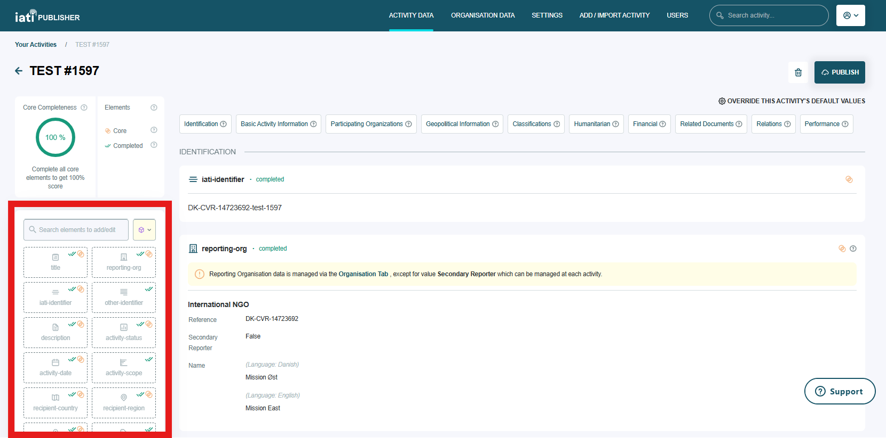

####################
Creating an activity
####################

The IATI data standard includes two types of data file - organisation and activity. The activity file includes information on the activities that your organisation carries out, such as your projects or humanitarian interventions. The IATI Standard includes data fields on what the activity is, where it is taking place, which organisations are involved and how it is financed.

Most users will create activities manually in the interface, by entering information about the activity in IATI Publisher's data entry forms. If you want to add multiple activities at once, see the section on `bulk importing <https://docs.publisher.iatistandard.org/en/latest/bulk-import/>`_.

Core elements
-------------
The IATI data elements that you can complete for an activity are listed on the left hand side of the activity page (Figure 1). Some are labelled “core” and have a yellow ring symbol.

It is recommended that you complete “core” elements. They are either mandatory according to the IATI Standard or required by most `donor governments’ publishing requirements <https://iatistandard.org/en/guidance/standard-overview/donors-reporting-requirements/>`_.

Other elements are optional. You are still encouraged to populate as many optional fields as you can, however, as this makes your data more useful to IATI's data users. 

    Figure 1: The IATI data elements that can be populated for an activity.

Adding or editing activity information
--------------------------------------
Click on each data element in the left hand menu of the activity page to add your data.

Mandatory fields are marked with a red asterisk (*) and are displayed towards the top of IATI Publisher’s data entry forms. These fields should always be populated to avoid errors in your published data. 

Optional fields are displayed in collapsed format towards the bottom of data entry forms. Use the arrow icons to expand and collapse these sections as needed.

    Figure 2: An example data entry form with mandatory fields highlighted at the top.
