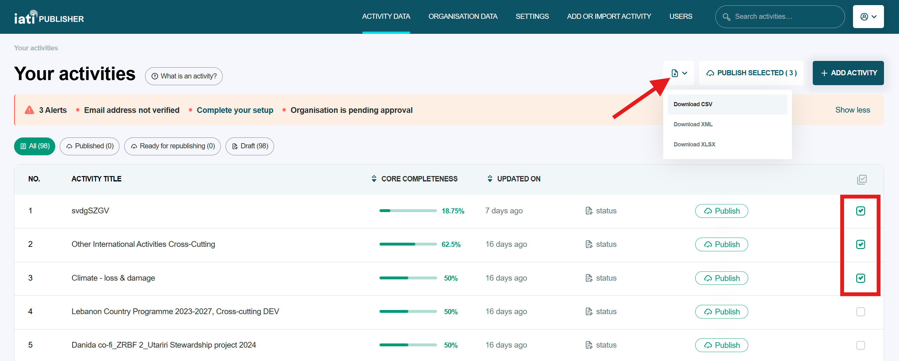
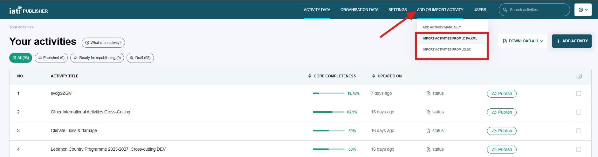
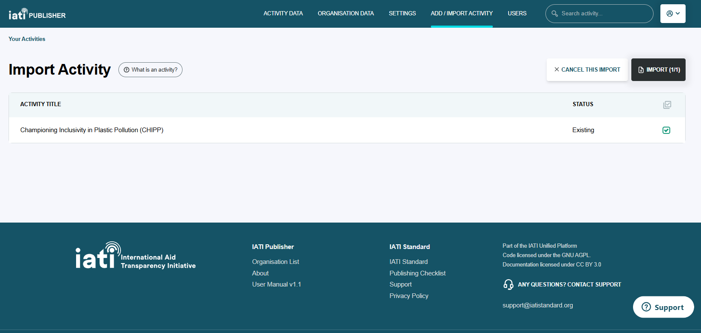

###################
Bulk data import
###################

IATI Publisher allows you to import and export activity data in three file formats (XML, CSV and XLSX). This functionality can be useful if you want to import multiple activities, transactions, budgets or results in one go.

All three file formats require complete activities to be uploaded (i.e. activities that include all mandatory elements according to the IATI Standard). New activities will be added to your list of activities in IATI Publisher. Existing activities (based on the activity identifier) will be overwritten. 

While it is possible to add new activities by bulk import, we normally recommend that activities are created manually in the IATI Publisher interface, with basic information entered first. The interface makes it clear which data elements are recommended vs. optional for a new activity.

**Example:** `How do I import transactions in bulk? <https://docs.publisher.iatistandard.org/en/latest/import-transactions/>`_

.. caution::

   IATI Publisher will overwrite your data in the interface if you upload data for an existing activity. Activity identifiers are checked during import to assess whether you are importing a new activity, or updating an existing one. Be careful to avoid losing data when overwriting existing activities.

Exporting your existing data
================
As IATI Publisher's import functionality requires complete activities to be uploaded, if you are updating an existing activity, you will need to export the data you have entered for it in the interface first. 

1. On the activity listing page, select the activity (or activities) that you want to edit or add data to. 
2. Click the download icon to the left of the 'Publish Selected' button.
3. Select which file format you want to work with from the drop-down menu:

If you choose XML or CSV, your data file will be prepared in the background and automatically downloaded (this could take up to a few minutes).

If you choose XLSX files, IATI Publisher will show a progress bar as your data files are prepared. You will need to click 'Download' in the bottom-right task box when prompted:

.. figure:: images/download-ready.png
    :width: 100 %
    :align: center
    :alt: Clicking the bottom-right 'Download' button when the XLS files have finished being prepared.

This will download a zipped (compressed) folder containing IATI Publisher's four XLSX templates.

Adding data
================
Once you have exported your activity data, you can edit or add to the exported file as needed, then re-import it to update your activity. Avoid changing the template structure in any way - e.g. by deleting columns or renaming sheets.

See `How do I upload transactions in bulk? <https://docs.publisher.iatistandard.org/en/latest/import-transactions/>`_ as an example.

Importing your data file
================

You can access the data import pages from 'Add or Import Activity' in IATI Publisher's header. Select the file format from the dropdown menu that you wish to use:

Import via XML
""""""""""""""""""
XML is the file format used by the IATI Standard. IATI Publisher creates and stores IATI XML files for you when you publish your activity and organisation data from the interface. The XML import functionality may be useful if you are transferring IATI activity data from a different publishing tool to IATI Publisher.

Import via CSV
""""""""""""""""""
You can download the IATI Publisher CSV template from the `CSV/XML data import page <https://publisher.iatistandard.org/import>`_. This template contains a wide range of IATI Standard fields and it is not necessary to populate everything. Refer to `IATI Standard guidance <https://iatistandard.org/en/iati-standard/203/activity-standard>`_ on how to interpret the fields. 

.. note:: 
   It is not possible to upload results, indicators or periods for your activities via the CSV import. Use the XLSX import functionality instead.

Import via XLSX
""""""""""""""""""
There are four templates available on the `XLSX import page <https://publisher.iatistandard.org/import/xls>`_. These cover basic activity data, results, indicators and periods.

See `Which import template should I use? <https://docs.publisher.iatistandard.org/en/latest/which-template/>`_ for help choosing the right template. If you are not publishing results data, you only need to use the 'Basic Activity Data' template. 

Pre-import checks
================
Once you have uploaded your data, IATI Publisher will list the activities ready for import with information on any data validation errors. These errors are from the `IATI Validator <https://validator.iatistandard.org/>`_.

Critical errors prevent the activity from being imported, whereas other errors will not prevent import. It is usually easier to fix errors in your data file before importing, rather than after in the interface.

You will have the chance to confirm the activities that you want to add or overwrite on the 'Import Activity' page:

.. toctree::
   :hidden:
   :titlesonly:
   :maxdepth: 3

   which-template
   import-transactions
   results-import
