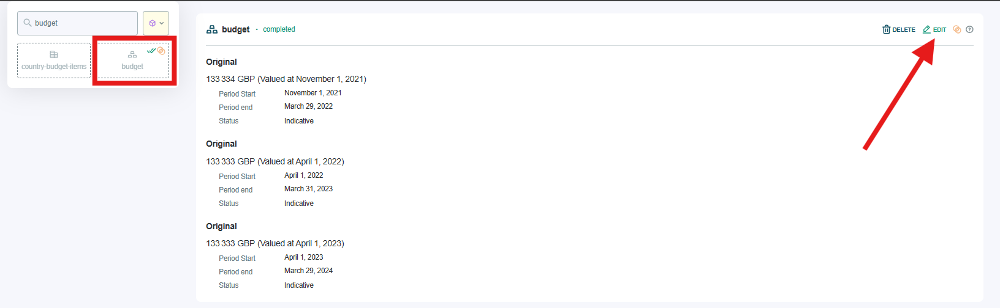
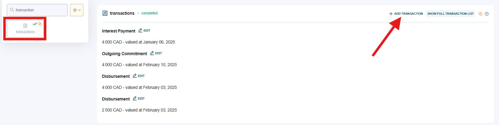
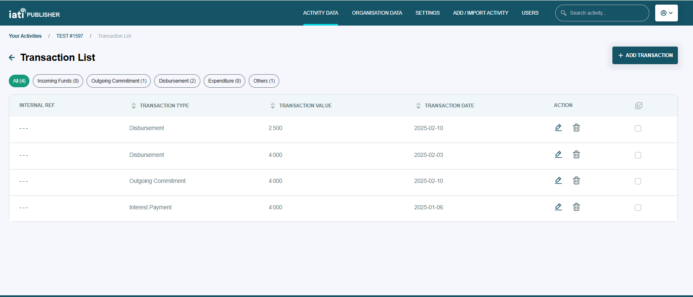

###################
Budgets and transactions
###################

Budgets are for each financial quarter (or year) over the lifetime of an activity. They are useful to give recipient countries predictability of funding and to inform their planning.

Transactions are a record of the incoming or outgoing funds for an activity. They have a date (in the past), value, provider organisation and recipient organisation.

.. tip:: 
   Add budgets or transactions individually in IATI Publisher's data entry forms, or in bulk via the `bulk import functionality <https://docs.publisher.iatistandard.org/en/latest/bulk-import/>`_.

Adding budgets
--------------
Locate "budget" in the left hand menu of elements for your activity, then click 'Edit' to open the data entry form (Figure 1).

You can add as many budgets as you need, noting that each budget period should be no longer than one year.

*Figure 1: Viewing and editing budget information from the activity detail page.*

Adding transactions
------------------------------------
Locate "transaction" in the activity element menu, then select a transaction to edit or click 'Add Transaction' to create a new one (Figure 2).

*Figure 2: Viewing and editing transaction information from the activity detail page.*

Information such as sector, recipient country and recipient region can be provided at either activity or transaction level, but not at both. If you have already populated this information at activity level, you won't be able to edit it in the transaction data entry form.

The Transaction List is another way to view your activity transactions (Figure 3). The table can be filtered or sorted to help you manage a large number of transactions in the interface.

*Figure 3: Viewing transaction information from the Transaction List.*
