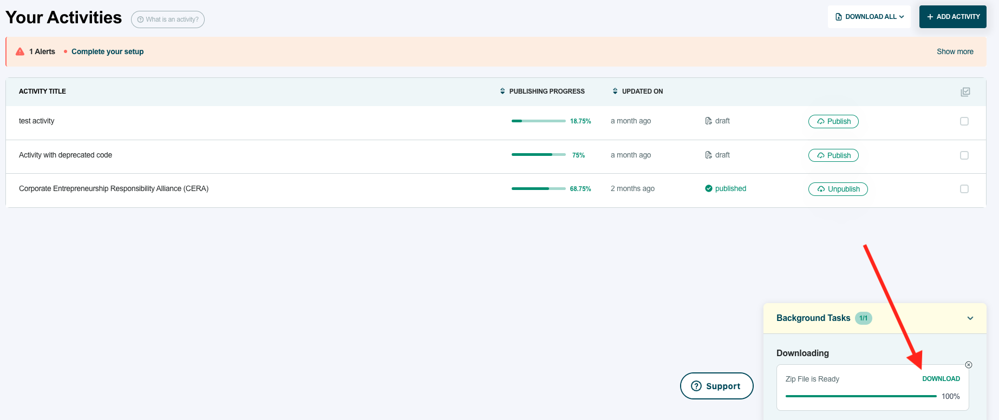
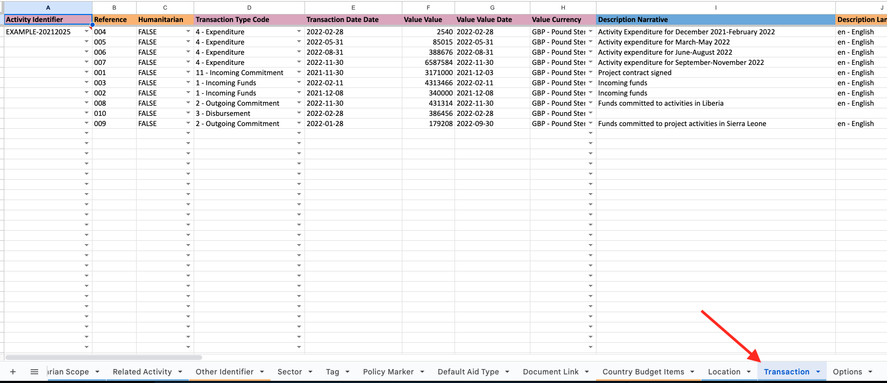
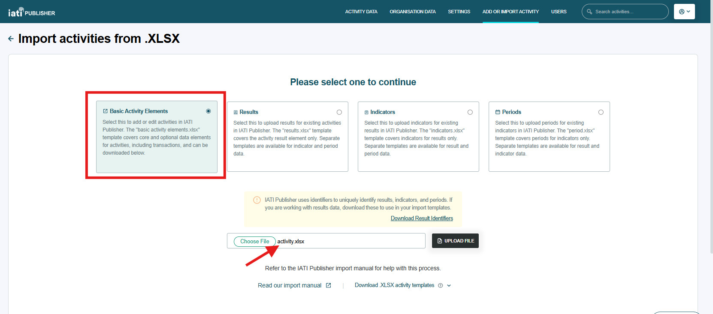

###################
How do I import transactions in bulk?
###################

You can use IATI Publisher's bulk import functionality to add or edit transactions for your existing activities. This involves exporting your existing activity data first and selecting which file format you want to work with (CSV or XLSX).

- `Importing via CSV <https://docs.publisher.iatistandard.org/en/latest/import-transactions/#id1>`_
- `Importing via XLSX <https://docs.publisher.iatistandard.org/en/latest/import-transactions/#id2>`_

Importing via CSV
-----------------

1. Follow the instructions for `exporting your activity data in CSV format <https://docs.publisher.iatistandard.org/en/latest/bulk-import/#exporting-your-existing-data>`_. 

2. In the downloaded CSV file, locate columns AH to BB to view your activity transaction data:

.. figure:: images/transaction-csv.png
    :width: 100 %
    :align: center
    :alt: Columns containing transaction data in the exported CSV file.

3. Add new transaction data on this sheet (one row per transaction). Data on this sheet will overwrite any existing transaction data in IATI Publisher, so make sure that you do not remove rows that you want to keep. Refer to the `transaction type codelist <https://iatistandard.org/en/iati-standard/203/codelists/transactiontype/>`_ to understand the different numerical codes you can enter in this column. 

4. Go to 'Add or Import Activity' from IATI Publisher's header menu, then select 'Import Activities from .CSV/.XML'.

5. Upload your edited CSV file. Your `data will be checked <https://docs.publisher.iatistandard.org/en/latest/bulk-import/#pre-import-checks>`_ and validation feedback given after you click "Upload file".

Importing via XLSX
-----------------

1. Follow the instructions for `exporting your activity data in XLSX format <https://docs.publisher.iatistandard.org/en/latest/bulk-import/#exporting-your-existing-data>`_. 

2. Wait for the download to be prepared, then click 'Download' in the bottom-right task box when ready:

3. Within the zipped folder downloaded, extract and open the file titled "activity.xlsx".

4. Locate the 'Transaction' sheet within the workbook. Add new transaction data on this sheet, ensuring one row per transaction. Data on this sheet will overwrite any existing transaction data in IATI Publisher, so make sure that you do not remove rows that you want to keep. Save the XLSX file when finished.

5. Go to 'Add or Import Activity' from IATI Publisher's header menu, then select 'Import Activities from .XLSX'.

6. On the 'Import Activities from .XLSX' page, select that you want to import "Basic Activity Elements", then upload your edited XLSX file. Your `data will be checked <https://docs.publisher.iatistandard.org/en/latest/bulk-import/#pre-import-checks>`_ and validation feedback given after you click "Upload file":

