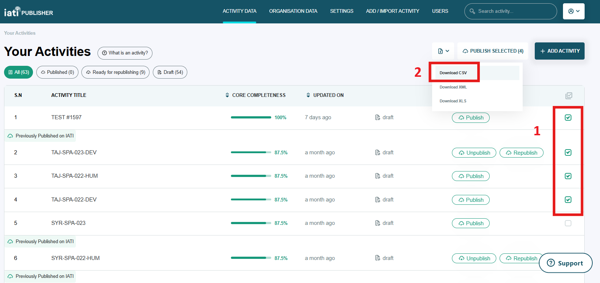
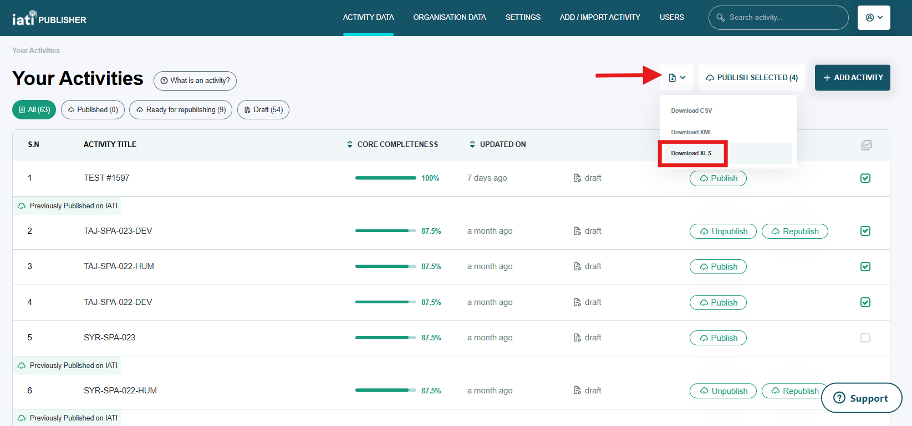

###################
How do I import transactions in bulk?
###################

You can use IATI Publisher's bulk import functionality to add or edit transactions for your existing activities. This involves exporting your existing activity data first and selecting which file format you want to work with (CSV or XLS).

`Importing via CSV <https://docs.publisher.iatistandard.org/en/latest/import-transactions/#importing-via-csv>`_

`Importing via CSV <https://docs.publisher.iatistandard.org/en/latest/import-transactions/#importing-via-csv>`_

In both cases, the columns listed below are mandatory to complete. Other transaction information is encouraged, but optional.

**Mandatory to complete:**

- Transaction Type
- Transaction Date
- Transaction Value
- Transaction Value Data

Importing via CSV
-----------------

1. On the activity listing page, select the activity (or activities) that you want to upload transactions for. 
2. Click the download icon to the left of the 'Publish Selected' button, then select "Download CSV" from the drop-down menu:

3. In the downloaded CSV file, locate columns AH to BB to view your activity transaction data:

.. figure:: images/transaction-csv.png
    :width: 100 %
    :align: center
    :alt: Columns containing transaction data in the exported CSV file.

4. Add new transaction data on this sheet (one row per transaction). Data on this sheet will overwrite any existing transaction data in IATI Publisher, so make sure that you do not remove rows that you want to keep. Save the CSV file when finished.

5. Re-upload the CSV file to IATI Publisher by going to 'Add/Import Activity' from the main menu, then 'Import Activities from .CSV/.XML'.

Importing via XLS
-----------------

1. On the activity listing page, select the activity (or activities) that you want to upload transactions for. 
2. Click the download icon to the left of the 'Publish Selected' button, then select "Download XLS" from the drop-down menu:

3. Wait for the download to be prepared, then click 'Download' in the bottom-right task box when ready:

4. Within the zipped folder downloaded, extract and open the file titled "activity.xlsx".

5. Locate the 'Transaction' sheet within the workbook. Add new transaction data on this sheet, ensuring one row per transaction. Data on this sheet will overwrite any existing transaction data in IATI Publisher, so make sure that you do not remove rows that you want to keep. Save the XLS file when finished.

.. figure:: images/transaction-xls.png
    :width: 100 %
    :align: center
    :alt: A screenshot of the Transactions sheet within the XLS template.

6. Re-upload the activity data to IATI Publisher by going to 'Add/Import Activity' from the main menu, then 'Import Activities from .xls'.

