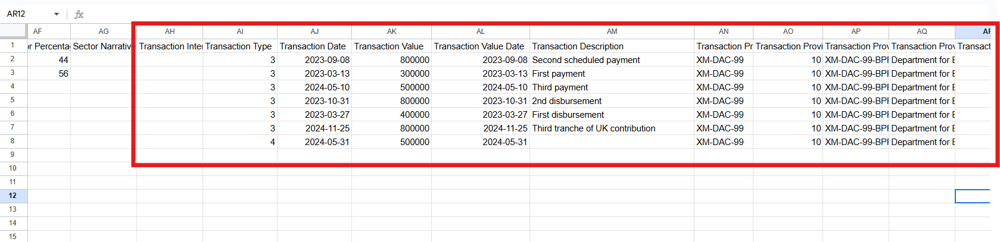
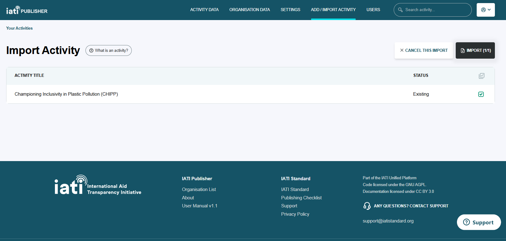

###################
How do I import transactions in bulk?
###################

You can use IATI Publisher's bulk import functionality to add or edit transactions for your existing activities. This involves exporting your existing activity data first and selecting which file format you want to work with (CSV or XLS).

Importing via CSV
-----------------

1. On the activity listing page, select the activity (or activities) that you want to upload transactions for. 
2. Click the download icon to the left of the 'Publish Selected' button, then select "Download CSV" from the drop-down menu.

    Figure 1: Selecting activities to export from the activity list.

3. In the downloaded CSV file, locate columns AH to BB to view your activity transaction data.

    Figure 2: Columns containing transaction data in the exported CSV file.

4. Add new transaction data on this sheet (1 row per transaction). The columns listed below are mandatory to complete, whereas other columns are encouraged, but optional.

Mandatory to complete:

- Transaction Type (column AI)
- Transaction Date (column AJ)
- Transaction Value (column AK)
- Transaction Value Data (column AL)

This data will overwrite any existing transaction data in IATI Publisher, so make sure that you do not remove existing rows that you want to keep. Save the CSV file when finished.

5. Re-upload the CSV file to IATI Publisher by going to 'Add/Import Activity' from the main menu, then 'Import Activities from .CSV/.XML'.

6. Your activity data will be checked before upload and any validation errors will be listed. You will have the chance to confirm the activities that you want to add or update on the 'Import Activity' page.

    Figure 3: The 'Import Activity' screen allows you to confirm which activities you want to add or overwrite.

