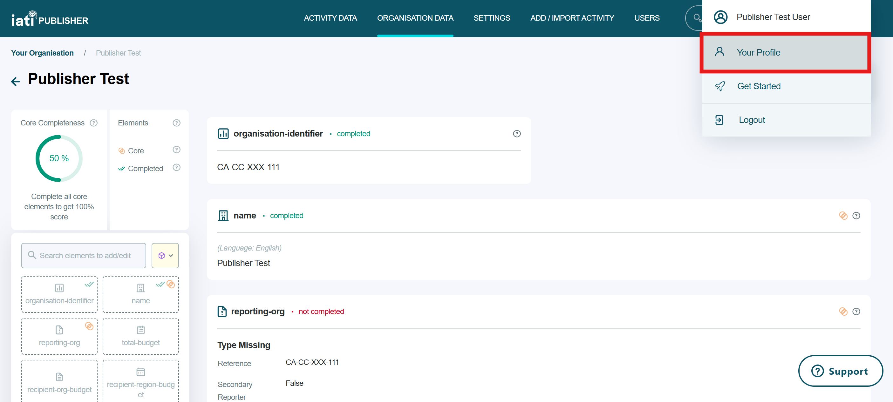

#####################
Managing your profile
#####################

.. attention:: 
    Any changes to your user information need to be made in IATI Account. User information can no longer be edited via IATI Publisher. 

While signed in to IATI Publisher, you can view your profile information via the user icon in the top-right corner of the screen. Click this, then select 'Your Profile' from the drop-down menu. 

    Figure 1: Accessing 'Your Profile' from IATI Publisher's top-right dropdown menu.
