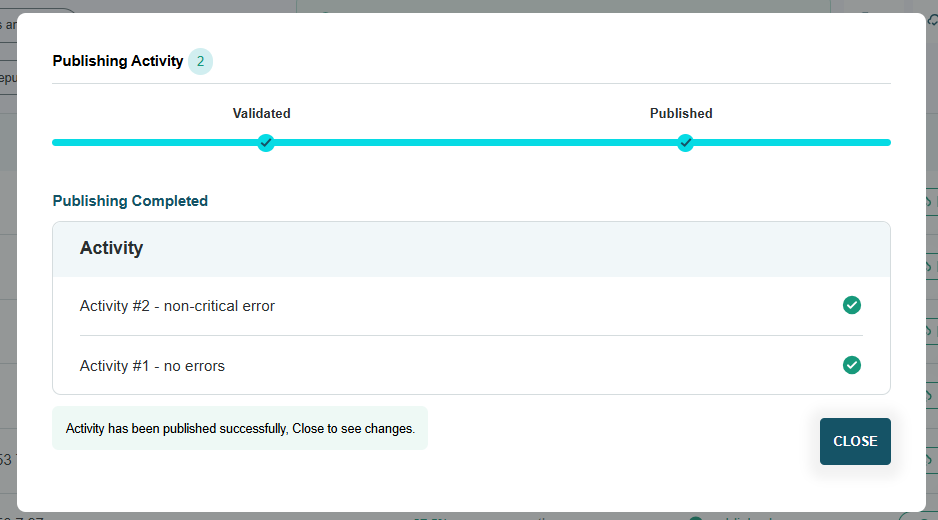

###################
Publish an activity
###################

Multiple activities can be published at once from the activity listing page, or individually from each activity's detail page. 

    Figure 1: Publishing multiple activities from the activity list.

    Figure 2: Publishing a single activity from its activity detail page.

If the activity has been edited since it was first published, you will see the option to “Republish”. Republishing is necessary to update your public data.

Publishing workflow
-------------------

**Checking core elements**

IATI Publisher will first check your activities for 'core element' completeness. It is recommended that you populate core elements based on IATI Standard rules and most donor governments’ publishing requirements. 

Core elements are labelled with yellow rings in the IATI Publisher interface:

    Figure 3: Core (recommended) elements to populate for your activity.

After you click to publish your activity data, you will see a warning if any activities are missing core elements:

    Figure 4: Warning message about some core elements being missing.

You can cancel publishing at this point to go back and review your activities. Ensuring core elements are complete will help avoid errors at the next validation step.

*Data validation*
If you continue to publish, your activity data is checked next using the IATI Validator. This assesses data based on the rules and guidance of the IATI Standard, to make sure it is accessible and useful to data users. 

Activities with validation issues are labelled in a list: 

    Figure 5: Feedback displayed on validation errors before publication.

Click on 'Open in new tab' to view your activity. On the activity detail page, expanding the text box in the top right will display information on the validation errors: 

    Figure 6: More detail displayed on the validation error(s).

You can often click on each error to be taken to the relevant data entry form in IATI Publisher where a correction is needed.

There are different levels of severity for validation errors. Importantly, you will not be able to publish any activity that has critical errors. Critical errors usually prevent your activity from being publicly visible in IATI’s tools, so it is important to correct these before publication.

If you return to the publication process after having made changes to one of your activities, you will be prompted to revalidate (i.e. recheck) your data before continuing:

    Figure 7: Revalidating an activity after making changes.

*Data publication*
If no errors are found during the validation step, IATI Publisher will continue to publish your activities. 

You’ll see a confirmation screen once publication has completed: 

    Figure 8: Confirmation that your activity data has been published.

Unpublishing activity data
--------------------------
Once published, IATI activities should remain public even after they have finished. You can update and republish your activity data as often as needed, for example to update budgets or end dates.

In some cases, however, activity data needs to be removed from public view. To do this, you can 'unpublish' your activity in IATI Publisher.

To delete an activity from the IATI Publisher interface, select its checkbox in the activity list then click on the trash can icon next to 'Add Activity'. Deleting permanently removes the activity from IATI Publisher. You will be asked to unpublish the activity first, if applicable.
