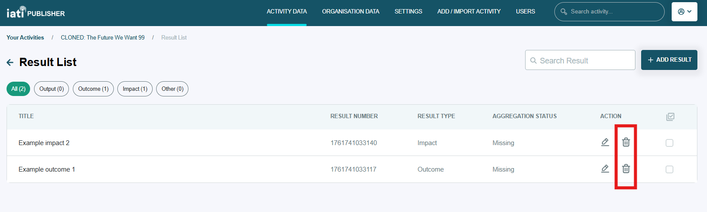

#######
Results
#######

Each result must have at least one indicator. This is a rule of the IATI Standard and should be followed to avoid errors in your published data.

Periods can be added to indicators to record their target and actual values over time. Periods are not essential to add to your indicators before publishing for the first time. A result can have multiple indicators, and each indicator can have multiple periods.

You can add indicators and periods from the activity detail page (Figure 1), or from the individual result page.

    Figure 1: How to add a new indicator or period from the activity detail page.

Deleting results, indicators or periods
----------------------------------------
Deleting a result in the interface will delete any indicators or periods associated with it. 

    Figure 2: How to delete results from the Results List.

To delete an indicator or period, click on 'Show full indicator list' or 'Show full period list' from the activity detail page, then locate the trash can icon next to the entry you want to delete.
