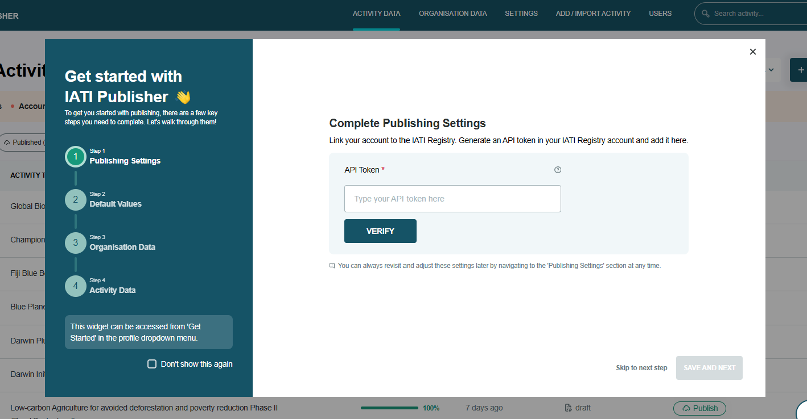

##########
Signing in
##########

.. attention:: 
    IATI Publisher switched to use IATI single sign-on in December 2025. You will need an `IATI Account <https://account.iatistandard.org/en/>`_ to use IATI Publisher. All existing user accounts are being automatically migrated 1-5th December. 

Sign in to IATI Publisher with your `IATI Account <https://account.iatistandard.org/en/>`_ email address and password. You can reset your password if needed.

Getting Started
-----------------

When you first sign in, you will see 'Get Started' guidance on screen, which will walk you through the setup steps (Figure 1).

    *Figure 1: 'Get Started' onboarding guidance to help your organisation get set up.*

Select 'Don’t show me this again' in the bottom-left corner of the guidance box to stop it appearing when you sign in. You can re-access it from your profile menu if needed.

Adding other people from your organisation to IATI Publisher
------------------------------------------------------------
All new users should create an account via IATI Account. If their organisation is already registered with IATI, they will be able to search for it and request to be added to it.

Once their request is appoved, the new user will be able to sign in to IATI Publisher and see their organisation's data.

.. admonition:: Getting help

    If you are unable to sign in, or need help getting access to your organisation's account, please `contact us <https://iatistandard.org/en/contact/>`_.
